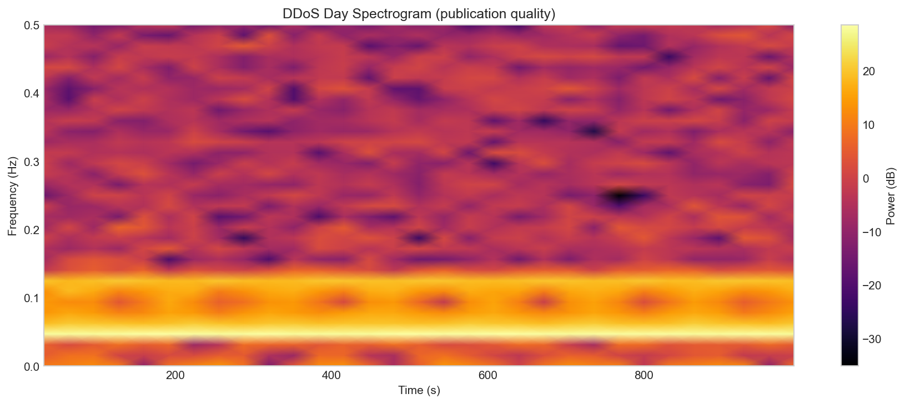
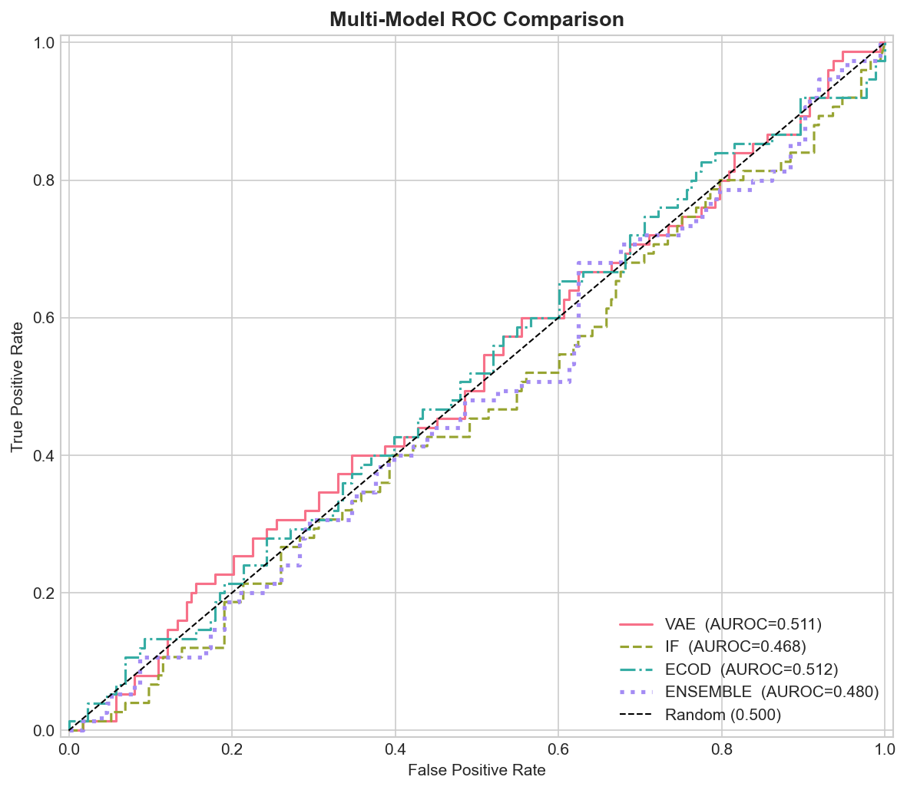
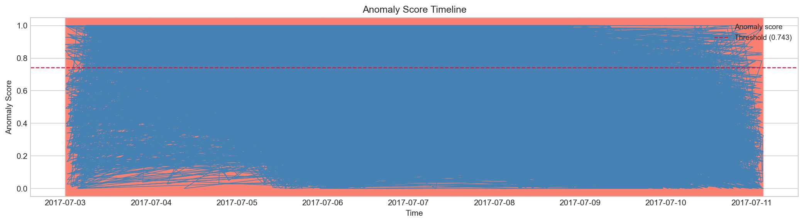

# Network Spectral Anomaly Detector

[](https://www.python.org/)
[](https://github.com/awiecz/Network-Spectral-Anomaly-Detector/actions/workflows/ci.yml)
[](https://www.unb.ca/cic/datasets/ids-2017.html)
[](LICENSE)

**Unsupervised network intrusion detection using FFT spectral fingerprints.**

Raw CICFlowMeter flows are binned into time series, transformed with a Hann-windowed FFT, and scored by a tuned ensemble of anomaly detectors trained **only on benign Monday traffic**. On the CICIDS2017 Friday hold-out (majority window rule), the tuned ensemble reaches **AUROC 0.956** and **AUPRC 0.869** for volumetric **DDoS** and **PortScan** attacks — no attack labels used in training.

> **Scope:** window-level detection of attacks that **dominate a 64 s window**. Low-and-slow bot C&C is out of scope (AUROC **0.37** under the stricter `any` label rule). See [Limitations](#limitations) and [docs/RESULTS.md](docs/RESULTS.md).



<p align="center">
  
  
</p>

---

## Key Results

All numbers are produced end-to-end by `main.py` / `tune.py` and stored under [`results/metrics/`](results/metrics/) — not hand-tuned. Full tables: [docs/RESULTS.md](docs/RESULTS.md).

**Protocol:** Monday benign train · validation thresholds · Friday test · window labelled *attack* when **≥ 50 %** of flows are malicious (`window_label_rule: majority`).

| Model | AUROC | AUPRC | F1 | FPR |
|-------|-------|-------|-----|-----|
| **Ensemble (tuned)** | **0.956** | **0.869** | **0.871** | **0.106** |
| ECOD | 0.954 | 0.870 | 0.864 | 0.116 |
| Isolation Forest | 0.939 | 0.824 | 0.851 | 0.118 |
| β-VAE | 0.920 | 0.770 | 0.832 | 0.165 |

**Per-attack AUROC (ensemble):** DDoS **0.959** · PortScan **0.953**

**Spectral vs raw baseline** ([`baseline_comparison.csv`](results/metrics/baseline_comparison.csv)): ECOD on spectral windows **0.954** vs window-aggregated raw CICFlowMeter features **0.794** (+0.16 AUROC).

**Operational thresholds** ([`threshold_comparison.csv`](results/metrics/threshold_comparison.csv)): at `fpr_0.05` → precision **0.89**, recall **0.77**, FPR **4.7 %**.

---

## Pipeline Architecture

End-to-end flow (`main.py` → `tune.py`):

1. **Ingest** — Load CICIDS2017 flows; aggregate into 1-second bins of bytes, packets, and mean duration.
2. **Spectralize** — Apply Hann-windowed FFT on 64 s windows (50 % overlap) and a 256 s slow branch; extract 13 descriptors per channel (entropy, centroid, flatness, rolloff, …).
3. **Scale** — Fit `RobustScaler` on Monday benign windows only; transform val/test with the same statistics.
4. **Score** — Run a tuned ensemble (validation AUROC ≥ 0.55 per model): **ECOD 75 %** + **Isolation Forest 25 %**. β-VAE, COPOD, HBOS, and Deep SVDD are implemented but excluded after tuning.
5. **Decide** — Pick an operating threshold on validation (F1-optimal, Youden-J, or FPR-targeted) and report metrics on the Friday hold-out.

Individual models (β-VAE, ECOD, Isolation Forest, COPOD, HBOS, Deep SVDD) are all implemented; [`tune.py`](tune.py) selects weights and hyperparameters on validation. Deep SVDD scores are **inverted** on this representation (attacks map closer to the hypersphere centre than benign traffic), so it is excluded rather than sign-flipped — see [Engineering decisions](#engineering-decisions).

---

## Engineering Decisions

- **Debugging arc:** a label-alignment bug produced ~0.48 AUROC (random). After fixing splits and evaluation, an honest VAE + IF baseline reached 0.83 under the strict `any` rule; adding ECOD + tuned weights and the `majority` rule for volumetric attacks brought the ensemble to **0.956**.
- **Deep SVDD exclusion:** implemented with AE pretraining (Ruff et al.); validation AUROC ≈ 0.2 on spectral features. A guard (`val AUROC ≥ 0.55`) drops it from the ensemble — a property of the representation, not a training bug.
- **Flow-level ECOD fusion:** per-flow CICFlowMeter branch implemented; `tune.py` set `fusion_weight = 0.0` on this split (no validation gain). Ablation: `python scripts/ablation_flow_fusion.py`.
- **Performance:** vectorized batched FFT ([`scripts/benchmark_spectral.py`](scripts/benchmark_spectral.py)) and optional split cache (`--use-cache`) for reproducible reruns.
- **Dual evaluation:** `dual_eval: true` in config also writes `*_any_rule.csv` metrics for stricter labelling.

---

## How Spectral Features Work

Network traffic over time behaves like an audio signal: periodic processes (scan probes, flood pulses) leave distinct frequency-domain fingerprints:

| Attack Type | Spectral Signature |
|-------------|-------------------|
| **DDoS flood** | High centroid, low entropy — energy at high frequencies |
| **Port scan** | Low flatness — dominant single frequency (scan rate) |
| **Normal traffic** | High entropy, flat spectrum — broadband and irregular |

Each window extracts **13 descriptors × 3 channels** (bytes, packets, duration), plus delta statistics and a **256 s slow-scale branch** when multi-scale mode is enabled ([`config/config.yaml`](config/config.yaml)). Details: [docs/methodology.md](docs/methodology.md).

---

## Installation

### Option A — pip

```bash
git clone https://github.com/awiecz/Network-Spectral-Anomaly-Detector.git
cd Network-Spectral-Anomaly-Detector
pip install -r requirements.txt
```

### Option B — conda

```bash
conda env create -f environment.yml
conda activate spectral-anomaly
```

---

## Quick Start

**Smoke test** (synthetic sample, no download):

```bash
python main.py --use-sample
pytest tests/ -q
```

**Full pipeline** (requires [CICIDS2017](data/README.md)):

```bash
python main.py --data-dir data/raw/cicids2017 --config config/config.yaml
python tune.py --data-dir data/raw/cicids2017 --use-cache
python scripts/baseline_comparison.py --data-dir data/raw/cicids2017 --use-cache
```

**Outputs:**

```
results/
├── metrics/          ← authoritative CSV tables (committed)
│   ├── model_comparison.csv
│   ├── baseline_comparison.csv
│   └── …
└── figures/          ← regenerated plots (gitignored)
docs/assets/          ← curated README figures (committed)
```

Optional artifacts (`per_attack_flow_level.csv`, `fusion_ablation.csv`) are written when the full dataset is available and the corresponding scripts are run.

---

## Notebooks

Interactive walkthrough of the pipeline in [`notebooks/`](notebooks/). They call the same `src/` helpers and [`config/config.yaml`](config/config.yaml) as `main.py` / `tune.py`.

**Run order:** `01` → `02` → `03` → `04` → `05` (each notebook imports shared utilities from [`notebooks/nb_common.py`](notebooks/nb_common.py)).

```bash
jupyter notebook notebooks/
```

| Notebook | Purpose |
|----------|---------|
| `01_eda_and_preprocessing.ipynb` | Flow-level EDA (exploratory; not the detector input path) |
| `02_spectral_feature_engineering.ipynb` | FFT demos + build spectral train/val/test splits |
| `03_model_training.ipynb` | Train VAE, IF, ECOD, COPOD, HBOS on benign windows |
| `04_ensemble_and_evaluation.ipynb` | Ensemble fusion, thresholds, metrics, optional weight grid |
| `05_visualizations.ipynb` | Timeline, spectrogram, UMAP, ROC, SHAP figures |

**Sample vs full data:** Each notebook sets `NotebookSettings(use_sample=True)` by default (no CICIDS2017 download). For full-dataset runs, set `use_sample=False` and point `data_dir` at your CICIDS2017 CSV folder in notebooks 02–05.

**Authoritative metrics:** Committed CSVs under [`results/metrics/`](results/metrics/) come from `python main.py` and `python tune.py`. Notebooks may reuse the same splits cache (`--use-cache` / `use_cache=True`) after notebook 02.

---

## Performance

The spectral FFT step is the main bottleneck on full CICIDS2017 data.

```bash
# Reuse cached train/val/test window matrices
python main.py --data-dir data/raw/cicids2017 --use-cache

# Benchmark legacy vs vectorized FFT
python scripts/benchmark_spectral.py
```

Invalidate `data/processed/splits_cache_*.npz` after changing spectral settings, split logic, or `window_label_rule`.

---

## Project Structure

```
Network-Spectral-Anomaly-Detector/
├── config/config.yaml           ← hyperparameters
├── docs/
│   ├── methodology.md           ← technical write-up
│   ├── RESULTS.md               ← evaluation summary
│   └── assets/                  ← README showcase figures
├── scripts/
│   ├── baseline_comparison.py     ← spectral vs raw baseline
│   └── ablation_flow_fusion.py
├── src/
│   ├── spectral_features.py     ← FFT pipeline
│   ├── splits.py                ← train/val/test logic
│   ├── evaluation.py            ← metrics
│   └── models/                  ← VAE, ECOD, IF, ensemble, …
├── notebooks/                   ← interactive pipeline (01–05)
│   └── nb_common.py             ← shared notebook utilities
├── tests/                       ← pytest suite
├── main.py                      ← end-to-end CLI
└── tune.py                      ← hyperparameter + weight search
```

---

## Models

| Model | Type | Status on this dataset |
|-------|------|------------------------|
| **ECOD** | Statistical tail detection | Primary detector (75 % ensemble weight) |
| **Isolation Forest** | Tree ensemble | Secondary (25 % weight) |
| **β-VAE** | Deep generative | Implemented; weight → 0 after tuning |
| **Deep SVDD** | Deep one-class | Excluded (inverted scores) |
| **COPOD / HBOS** | Statistical | Implemented; excluded after tuning |

---

## Limitations

- **Stealthy / low-volume attacks.** Botnet C&C never dominates a window under the `majority` rule; under `any` labelling its AUROC is **0.37**. Flow-level ECOD fusion is implemented but did not improve validation metrics on this split.
- **Synthetic timestamps.** CICIDS2017 CSVs lack reliable timestamps; an ordered 1-flow-per-second timeline is synthesised. Byte/packet/duration channels carry most of the spectral signal.
- **Deep SVDD polarity.** Attacks are *more* compact in latent space than diverse benign traffic on spectral features — excluded from the ensemble by design.

---

## Progression (measured)

| Stage | Ensemble AUROC |
|-------|----------------|
| Honest baseline (VAE + IF, `any` rule) | 0.830 |
| + ECOD + tuned weights | 0.866 |
| + `majority` rule (volumetric attacks) | **0.956** |

Under the `any` rule, ensemble AUROC is **0.877** overall ([`model_comparison_any_rule.csv`](results/metrics/model_comparison_any_rule.csv)).

---

## References

1. Aldarwbi M. et al. (2022). "The Sound of Intrusion." *Computers & Electrical Engineering*.
2. Zavrak S. & Iskefiyeli M. (2020). VAE for flow anomaly detection. *IEEE Access*.
3. Ruff L. et al. (2018). Deep one-class classification. *ICML*.
4. Li Z. et al. (2022). ECOD. *IEEE TKDE*.
5. Sharafaldin I. et al. (2018). CICIDS2017 dataset. *ICISSP*.

---

## License

Released under the [MIT License](LICENSE).
